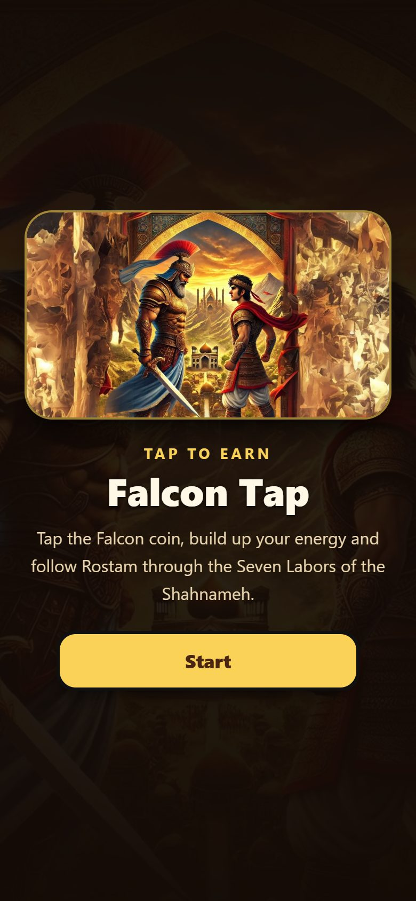
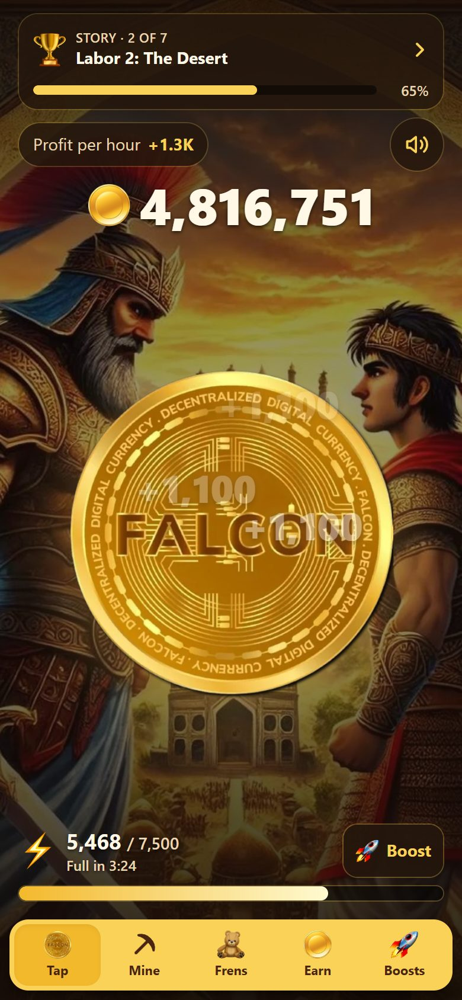
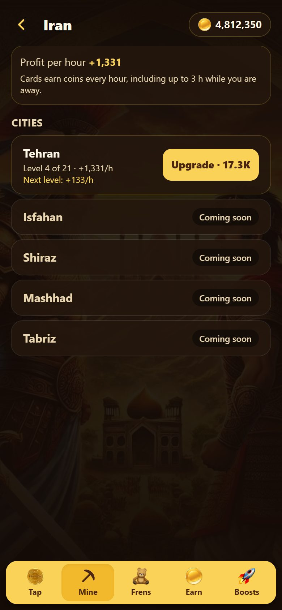
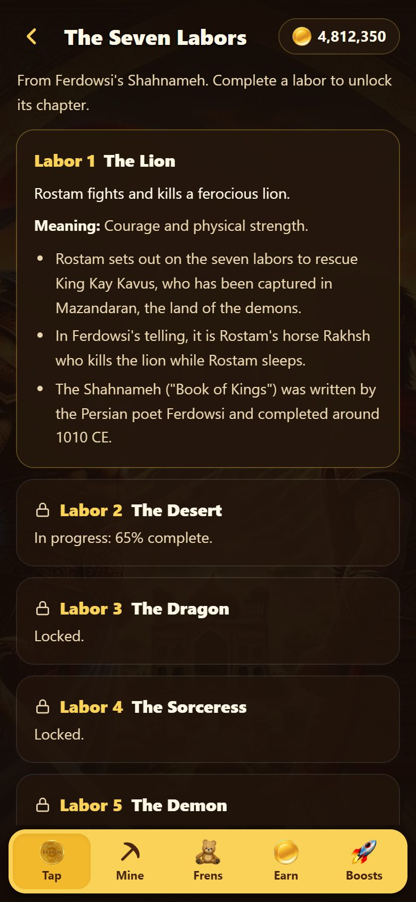
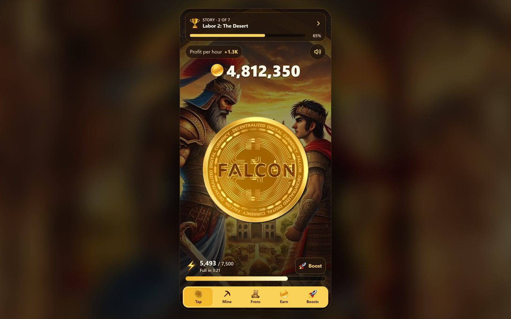

<div align="center">


# Falcon Tap

**Tap. Power up. Follow Rostam through the Seven Labors of the Shahnameh.**

A mobile-first, Hamster Kombat-style tap-to-earn game for Telegram, built with React and TypeScript.

[](https://t.me/Arshian_Pahlevan_Bot/FalconTapGAme)
[](https://falcomtaptapgame.netlify.app/)


<br />






</div>

## ✨ Features

| | |
|---|---|
| 👆 **Tap to earn** | Every tap, click or key press counts exactly once. Multi-touch works too. |
| ⚡ **Energy** | Refills over time, even while the game is closed. Raise the limit with Boosts. |
| 🏛️ **Seven Labors** | Seven levels from Ferdowsi's *Shahnameh*, each unlocking a story chapter. |
| ⛏️ **Mine** | Buy and upgrade region, country and city cards that earn coins every hour. |
| 💾 **Auto-save** | Progress is saved on your device and validated when it loads. |
| 📱 **Any screen** | Full-screen on phones, a phone-shaped frame on laptops, at home inside Telegram. |

<details>
<summary>🖥️ <b>See it on a laptop</b></summary>
<br />

</details>

## 🚀 Run it locally

You need [Node.js 24](https://nodejs.org/) (see `.nvmrc`).

```bash
npm ci        # install
npm run dev   # play at http://localhost:5173
```

| Command | What it does |
|---|---|
| `npm run build` | Type-check and build for production |
| `npm test` | Run the unit tests |
| `npm run lint` | Check the code style |
| `npm run simulate:economy` | Simulate 31 days of play ([results](docs/economy.md)) |

> 💡 In development, add `?debug` to the URL for shortcuts such as skipping to the next labor.

## 🗂️ Project layout

```
shared/   game rules and every tunable number (economy.ts)
src/      the React app: screens, components, saving, story text, Telegram glue
scripts/  economy simulation
docs/     economy notes, original requirements, screenshots
```

## 🗺️ Roadmap

- [x] Tap, energy and auto-save
- [x] Seven Labors with story chapters
- [x] Energy boosts and mining cards
- [ ] Game server and Telegram bot (`/start`, `/tap`, `/score`)
- [ ] Invite friends and social tasks
- [ ] Full card catalog and art for each level
- [ ] Token rewards

The full plan is in [Plan.md](Plan.md), and the original brief is in [docs/requirements.md](docs/requirements.md).

## ☕ Support

If you like this project, consider **buying me a coffee**. Your support keeps me going! 💛

[](https://razorpay.me/@pycraftr)
